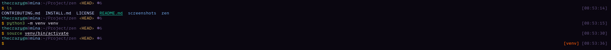

# Zen Theme for Oh-My-Zsh



## Overview

Zen is a clean, informative, and customizable theme for Oh-My-Zsh that provides essential information without cluttering your terminal. It was designed with Python developers in mind and includes smart features like SSH detection, detailed Git status information, and command execution time tracking.

## Features

- **Clean and Minimal Design**: Provides essential information without cluttering your terminal
- **Smart Context Awareness**:
  - SSH detection with color changes for remote sessions (blue username, purple hostname)
  - Root user detection with special prompt symbol (red # for root)
  - Last command status indication (red $ for failed commands)
- **Enhanced Git Integration**:
  - Shows branch name with colored angle brackets (‹branch›)
  - Clean/dirty status indicators (✓/✗)
  - Detailed change indicators (staged, unstaged, untracked)
  - Ahead/behind tracking with up/down arrows and counts
  - Stash count indicator
- **Development Environment Indicators**:
  - Virtual environment display in right prompt
  - Command execution time for long-running commands (shows time for commands >5s)
- **Flexible Layout Options**:
  - One-line or two-line prompt formats
  - Optional time display
- **Flexible Path Display**:
  - Full path or truncated path options
  - Configurable number of directory levels to display

## Installation

### Manual Installation

1. Clone this repository:

   ```bash
   git clone https://github.com/thecrazygm/zen.git
   ```

2. Copy or symlink the theme file to your Oh-My-Zsh themes directory:

   ```bash
   cp zen/zen.zsh-theme ~/.oh-my-zsh/themes/
   # OR create a symlink
   ln -s $(pwd)/zen/zen.zsh-theme ~/.oh-my-zsh/themes/
   ```

3. Set `ZSH_THEME="zen"` in your `~/.zshrc` file

4. Restart your terminal or run `source ~/.zshrc`

## Configuration

Zen theme supports several configuration options that can be set in your `~/.zshrc` file:

```bash
# Show current time in prompt
export ZEN_THEME_SHOW_TIME=true

# Use two-line prompt format
export ZEN_THEME_TWO_LINES=true

# Show execution time for commands that take longer than 5 seconds
export ZEN_THEME_SHOW_EXEC_TIME=true

# Configure path truncation (0=full path, 1=current dir only, 2+=show n dirs)
export ZEN_THEME_PATH_TRUNCATE=2
```

## Customization

The theme uses standard ZSH color codes and Unicode symbols that can be easily modified in the theme file if you want to customize the appearance further.

## Credits

Created by Michael Garcia (thecrazygm), inspired by various themes including Aphrodite, Solus, and others.

## License

MIT License

---

[The Crazy GM](https://peakd.com/@thecrazygm)
